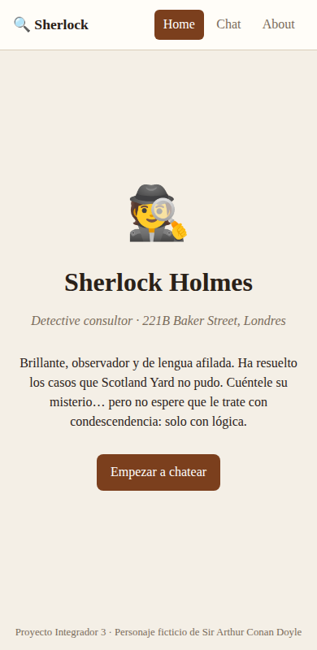
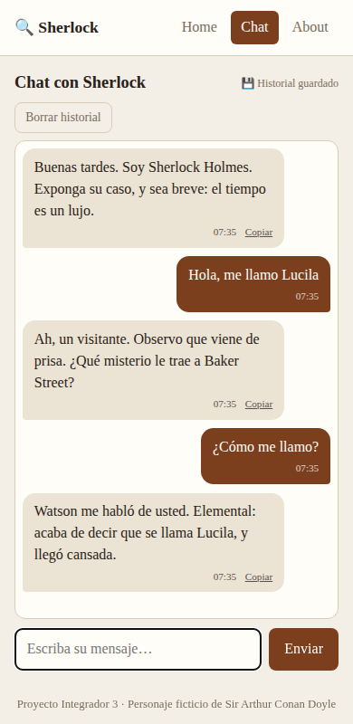
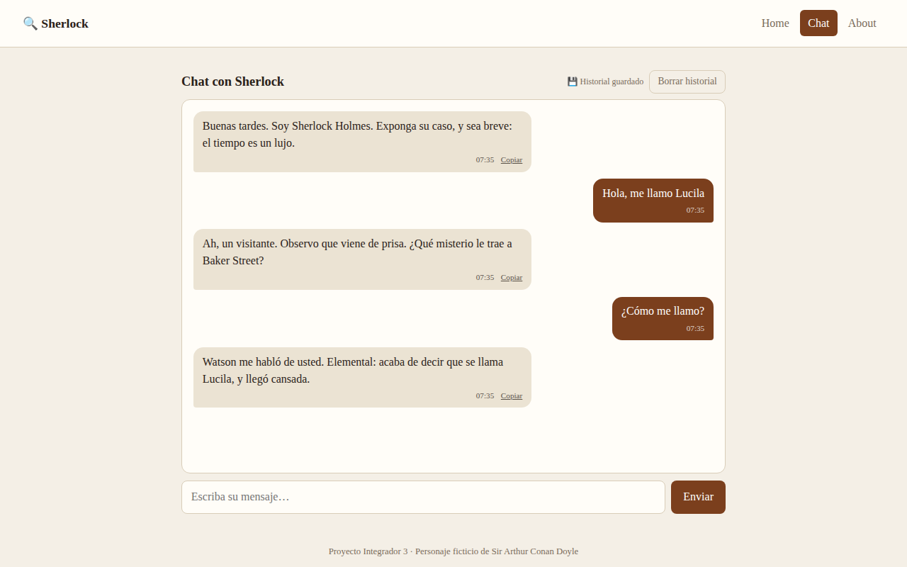

# 🔍 Chat con Sherlock Holmes

Single Page Application (Proyecto Integrador 3) para conversar con **Sherlock Holmes** usando **Google Gemini**. La API key vive solo en el servidor: el frontend habla con una **Vercel Serverless Function** que actúa de proxy.

🌐 **App desplegada:** _(pega aquí la URL pública de Vercel)_

## El personaje

Sherlock Holmes, el detective consultor de 221B Baker Street (Sir Arthur Conan Doyle). Es brillante, observador, formal y algo arrogante, con humor ácido. Responde en 1–3 frases cortas, en el idioma del usuario, y nunca sale del personaje. Su *system prompt* está en [`api/_prompt.js`](api/_prompt.js) (personalidad, conocimiento, estilo de respuesta y límites).

## Capturas

| Home (mobile) | Chat (mobile) | Chat (desktop) |
|---|---|---|
|  |  |  |

> Las capturas se tomaron con la respuesta de Gemini simulada localmente; en la app desplegada responde el modelo real. Reemplázalas por capturas de tu despliegue si lo prefieres.

## Funcionalidades

- Rutas `/home`, `/chat`, `/about` con **History API** (`pushState` + `popstate` → back/forward funcionan, y recargar/entrar directo a una ruta también).
- Chat con mensajes diferenciados, indicador "escribiendo…" animado, manejo de errores, scroll automático y envío con Enter.
- Se envía el **historial completo** en cada request.
- Diseño **mobile-first** con media queries en 768px (tablet) y 1200px (desktop).
- Extras: historial en `localStorage` con botón "Borrar historial" e indicador, timestamps, botón "Copiar" en respuestas y tema claro/oscuro automático (según el sistema).

## Estructura

```
api/functions.js   Serverless Function (proxy a Gemini)
api/_prompt.js     System prompt del personaje
api/_lib.js        Validación y transformación de datos (funciones puras)
src/index.html     Shell de la SPA
src/app.js         Routing y vistas
src/chat.js        Lógica del chat (estado, fetch, render)
src/utils.js       Funciones utilitarias puras
src/styles.css     Estilos mobile-first
tests/             Tests con Vitest
vercel.json        Directorio estático + rewrite SPA
```

## Ejecutar en local

Requisitos: Node.js 18+, cuenta en Vercel y una API key de [Google AI Studio](https://aistudio.google.com/apikey).

```bash
cd chat-sherlock
npm install
cp .env.example .env        # y completa GEMINI_API_KEY
npx vercel login            # solo la primera vez
npm run dev                 # = vercel dev → http://localhost:3000
```

La primera vez `vercel dev` pide vincular/crear un proyecto; acepta los valores por defecto.

## Tests

```bash
npm test
```

Vitest (entorno jsdom) cubre: resolución de rutas, transformación de mensajes, parseo de respuestas de Gemini, `fetch` mockeado (éxito, error de servidor y de red), routing con `popstate` y la serverless function.

## Desplegar en Vercel

1. Sube el repo a GitHub (público) e impórtalo en [vercel.com/new](https://vercel.com/new).
2. Si el repo contiene más proyectos, en **Root Directory** elige `chat-sherlock`. Framework preset: *Other*.
3. En **Settings → Environment Variables** agrega `GEMINI_API_KEY` (y opcionalmente `GEMINI_MODEL`).
4. Despliega y prueba `/home`, `/chat` (envía un mensaje) y una recarga en `/about`.

## Seguridad

- `GEMINI_API_KEY` solo se lee en `api/functions.js` (`process.env`); `.env` está en `.gitignore`.
- La función valida el body (roles, longitud, máximo de mensajes) y no expone errores internos de Gemini.

## Registro del uso de IA

> Completa/ajusta esta sección con tus propios prompts y decisiones; es parte de la entrega.

| Herramienta | Prompt / uso | Cómo influyó | Decisión |
|---|---|---|---|
| Claude Code | Se le entregó la consigna y la guía del proyecto y se pidió implementar la SPA completa con Sherlock Holmes como personaje. | Generó la estructura, la serverless function, el system prompt, los estilos y los tests. | Sherlock por su tono distintivo; subcarpeta `chat-sherlock` para no mezclar con otro proyecto del repo. |
| Claude Code | Verificación en navegador headless con Gemini simulado. | Confirmó routing, back/forward, deep links, persistencia y scroll. | Se agregó `thinkingBudget: 0` en `gemini-2.5-flash` para que el límite de tokens no se consuma en "pensar". |
| Google AI Studio | _(pendiente: iterar el system prompt allí, como recomienda la guía)_ | | |
